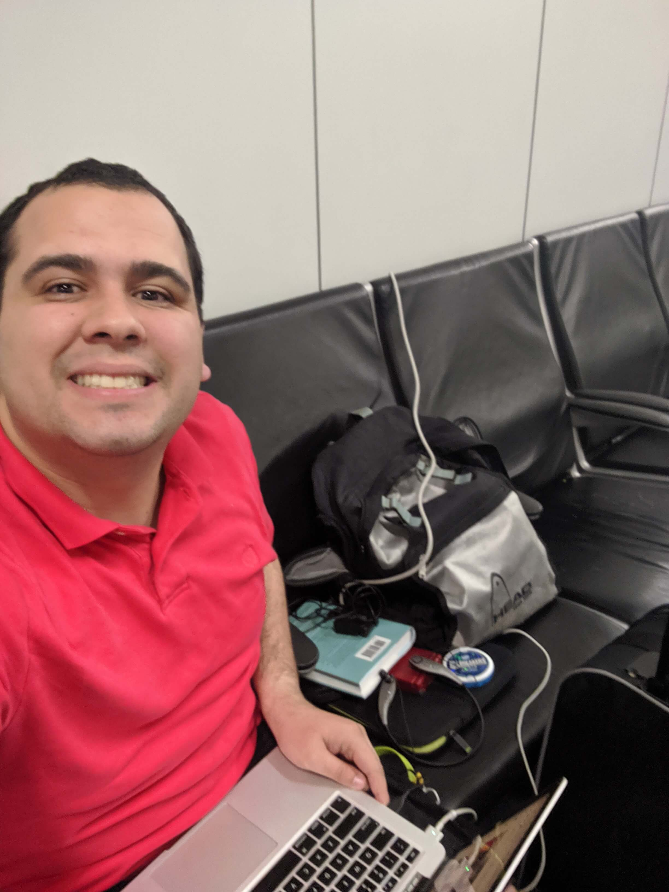

Normally I wouldn't be writing, let alone publishing, a blog post on a Sunday
since I typically spend time with Family or at Church. Today's a bit unique
since I got stranded in Dallas due to a weather delay causing me to miss the
connecting flight home last night. So, I'm a bit tired at this point as you can
see:

I noticed while I was here that it's August 25th, a date that in most cases
isn't particularly notable. There is one point of note for me though - it was 6
months ago today that I opened
[my first Pull Request](https://github.com/mikaelbr/node-notifier/pull/271) to
the [`node-notifier`](https://github.com/mikaelbr/node-notifier/) project on
github! Through the process of getting that pull request merged, and later
reverted and pushed to a v6 branch that we're working on now something pushed
Mikael (the project owner) to offer to have me help out as a contributor,
something that I'd never considered doing before. As this is my first foray into
real open source I wanted to record some thoughts that are hopefully helpful to
others. I say real open source to mean a project that is actually consumed
outside of itself (according to the github numbers there are 1.5 million
dependents on node-notifier), instead of something like my personal website
which is open source on github but doesn't impact anyone but me.

There's 5 main thoughts that I've experienced from getting into Open Source
Maintenance:

1. Issues happen, and can't always be dealt with instantly
1. Taking time to communicate clearly can make a huge difference
1. Prioritization - of the project and my time
1. Jumping in to help
1. Empathy is key

## Github Issues

The first thing that I tried to tackle when Mikael mentioned that he'd like some
help was the issue queue of open things that people had filed on github.
[As you can see on the repository](https://github.com/mikaelbr/node-notifier/issues)
there are lots of outstanding issues. I usually strive to reach inbox zero with
my emails, and since I've been doing that for a some time now it's relatively
easy to keep up with each day. But, one of the first things I had to accept when
getting into open source is the infinite nature of it. In most cases, there will
be an endless supply of issues that consumers could file, especially in projects
used in a wide variety of circumstances. If you happen to have one of the 52
issues open at the time of writing and it is still impacting you, please feel
free to [reach out to me on twitter](https://twitter.com/jnielson94) and I'll
take a look at it when I have time. Once I realized that the issues would likely
never be at "inbox zero" without some serious dedicated time and lots of
communication, I determined to do a good job responding quickly to new (or
updated) issues since those people are more likely to respond back and have the
relevant context still available.

## Communication Clarity

The next thing I realized quite quickly, as I was triaging the issues that were
open (until I decided to take the approach I decided above), was how important
taking some extra time to re-read the words I had written and ensure they
communicated what I wanted (something that I don't usually do for blog
posts/tweets/emails/etc). Because I've found so much benefit from coming across
old issues in other projects that I use, I wanted the responses I write to be
useful to people who might stumble upon the issue down the road. But, more
importantly, lots of the people interacted with on Github don't speak English as
their first language and do the best they can. Sometimes there are
misunderstandings, but trying to use clear and concise language will help
someone down the road, and while they might not thank you for it, knowing you
put in the little bit of effort to make your response more clear will leave you
(hopefully, since it does me) with a nice feeling. Being clearer in my
communications is something that I'll need to continue working on, but I feel
like I've definitely made some progress.

## Prioritization of Effort

Another thing that's been on my mind since being invited to collaborate on this
project is the idea of Prioritization. How does this fit into
family/work/blogging/etc? How do the issues raised compare to those things? How
do the issues rank compared to each other? How does an open source project
decide what to accept or work on? I don't have the answers to these questions,
but as I've been trying to wayfind in this new area of life I have found that I
don't necessarily need definitive answers to them. Prioritization is a shifting
sea of options and trade-offs, with something that might be the most important
thing today becoming significantly less important tomorrow. As such, I've found
that throwing an hour or two each week towards this helps me to keep a pulse on
it without feeling overwhelmed. Another perk of my current job is that I get to
work on open source that is used at our company, and since we use `Jest`
throughout our JavaScript projects, and `Jest` uses `node-notifier`, I can
easily justify taking the occasional break from other work tasks to tackle a few
things for this project. So far as comparing the issues amongst the other issues
to determine what should actually be worked on, I have tended towards
prioritizing the most recent issues since those are the most likely ones to
still be issues. There will continue to be improvements made in this area, but I
think one that could give some serious return is to clarify for `node-notifier`
what platforms/node versions we want to support and ensure that we hit those the
best that we can with a unified and consistent API where possible.

## Jump Right In

Related to Prioritization is the idea of Jumping In. Sometimes, it's useful to
just try and do the best you can. In this case, I tried to jump right in and
help with the open issues to get a feel for what could be improved in the
project since outside of the thing that I was working on it seemed to be in good
shape from when I was using it. But, I decided that the most useful thing I
could do was to get digging into the issues. I usually tried to jump in and see
if I could reproduce the issue on one of my machines, which isn't super
sustainable, but it worked for some initial testing. One of the hardest things
was making sure that my communication (as noted above) clearly indicated that I
was not an expert so it was just a suggestion. While I do have some solid
knowledge of the project at this point, I don't know the history or the context
of the choices that were made in the past. So, I try my best to provide some
sort of direction for the issue opener to try and leave questions for Mikael
whenever I come across them.

## Empathy is Key

The last thought I had while reflecting on this increased involvement in open
source was how impressive it is that there are people who maintain tens or even
hundreds and possibly thousands of open source projects. I personally don't
aspire to do much more than a couple at any time, particularly now that I'm more
familiar with how much work actively maintaining a project can be. While this
isn't a huge project, it is still a project that I've found useful in my
programming and that I want to make better for the other users of it. In this
effort I've gained so much more empathy for other maintainers of open source
projects and how much incredible effort they've put in to get the community to
the point it is with some incredible resources created by fantastic people.

As I continue to work in the open source community I have a number of goals and
things to continue to work on, but that will probably become a later post :)
Thanks for reading! Let me know if you have any feedback, and I'd love to hear
about your (hopefully positive) experiences getting into Open Source!

_Banner image courtesy of undraw.co_
