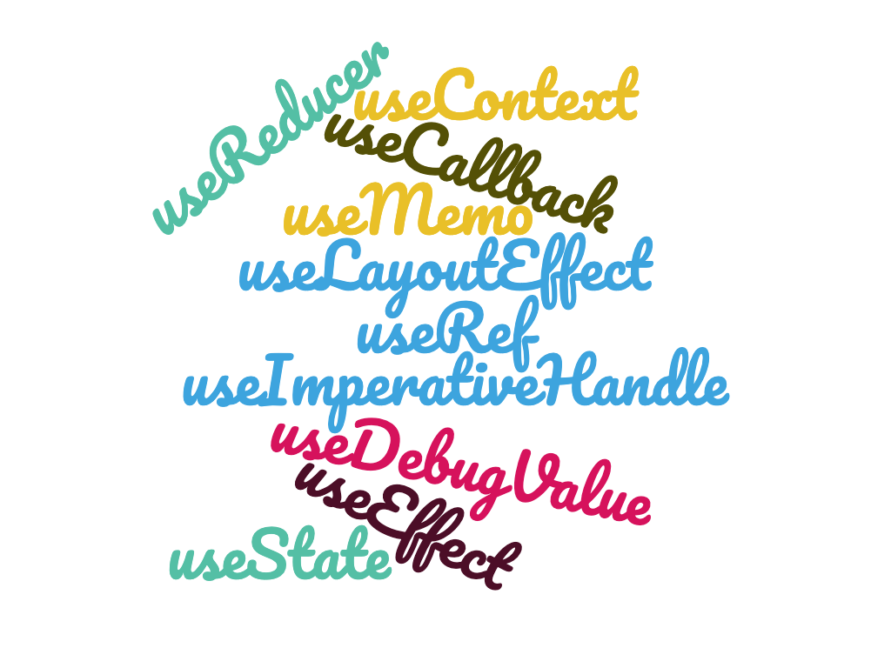
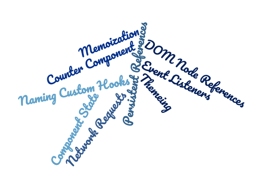

## The story behind the post

> Feel free to skip this section 😃

At work we pretty regularly give training to other developers with a wide range
of experience, one of our offerings being an internal "react bootcamp" that is
presented over the course of a week primarily targeting developers who are new
to react but have experience with JavaScript. As part of preparing for this
trianing I was assigned to add a section that I pointed out we should add-An
Intro to React Hooks. What this section should include was left for me to
determine, and as I searched around for documentation from the react team it
seemed like most of the information targeted people who had experience with
react already. For example, the official docs are focused on people with
experience.

The [Intro to hooks docs page](https://reactjs.org/docs/hooks-intro.html) page
states:

> Hooks are a new addition in React 16.8. They let you use state and other React
> features without writing a class.

The [Hooks at a glance](https://reactjs.org/docs/hooks-overview.html) page
states:

> This page provides an overview of Hooks for experienced React users. This is a
> fast-paced overview.

To further complicate this section, I don't want to include anything about
`state` since we have an entire section on that (which currently will follow
this one). This section will be after they've already been introduced to the
idea of components and the basics of props... So, the content for this section
will need to be introductory but won't be super detailed. I'm using this post as
a way to write down the ideas that are currently located in my head before
trying to condense them down into a slide format. I personally find it way
easier to create slides from a written post since it helps them to flow and be
more complete 😃 So, here goes nothing!

## Introduction to React Hooks

> I would love some feedback on this section, particularly if there's something
> that is important to understand before learning specific hooks. If you have
> feedback, I'd love to hear
> [feedback via twitter](https://twitter.com/jnielson94) (or some other means
> that you have of contacting me)

Welcome to React! I hope you've enjoyed the material so far, which covers topics
along the lines of these sections in the documentation:

1. [Hello World](https://reactjs.org/docs/hello-world.html)
2. [JSX](https://reactjs.org/docs/introducing-jsx.html)
3. [Rendering](https://reactjs.org/docs/rendering-elements.html)
4. [Components](https://reactjs.org/docs/components-and-props.html)

It hasn't covered everything in those sections, but for those who don't get to
go to the bootcamp, that's the basic knowledge that is expected at this point in
the training mentioned in the section above.

In order for the Components you've created so far to be more useful, React
exposes a number of "hooks" from the library that allow you to hook into various
features provided by React to make developing User Interfaces (UI) easier. React
components are, typically, _pure_ functions that receive `props` and return JSX
(your UI) based on those props without creating _side effects_ (like sending off
a network request). This model works well for a lot of components, but the
`props` need to start somewhere, and an application without _side effects_ is
generally a pretty boring place (for your users).

So, what hooks are available? The built-in ones currently exported from the
React library as named exports include:

<!-- Word cloud source: https://www.wordclouds.com/?yygpKSi20tfP1MvMTS8t0kvOz9X3DSqpSk1M1SvISwcA
1 useState
1 useEffect
1 useContext
1 useReducer
1 useCallback
1 useMemo
1 useRef
1 useImperativeHandle
1 useLayoutEffect
1 useDebugValue


 -->



> You'll notice that each of these begin with the prefix `use`, which is by
> convention to allow the
> [eslint plugin](https://reactjs.org/docs/hooks-rules.html#eslint-plugin) to
> enforce the [rules of hooks](https://reactjs.org/docs/hooks-rules.html) on the
> built-in hooks and any custom hooks that you write. Generally you won't need
> to worry about the rules of hooks as long as you prefix any custom hooks you
> write with `use` and listen to the eslint plugin output.

React hooks can only be used inside a function component (or custom hook), so if
you're working inside a class component you'll need to convert it to a function
component to use hooks.
[The React Team doesn't recommend doing this](https://reactjs.org/docs/hooks-intro.html#gradual-adoption-strategy)
to everything at once, since switching to hooks is not particularly a reason to
change working code (it is not like classes are going away in the near future).

Someone might ask why there's so many hooks available, but the behaviors hooks
unlock are incredibly varied! For example, these are a few of the types of
examples used in the documentation:

<!--
Word Cloud Source: https://www.wordclouds.com/?yygpKSi20tfP1MvMTS8t0kvOz9UvMXCrSkrK0yvISwcA
1 Theming
1 Counter~Component
1 Memoization
1 Network~Requests
1 Event~Listeners
1 DOM~Node~References
1 Component~State
1 Persistent~References
1 Naming~Custom~Hooks

 -->



Using hooks you can build most every application feature I can think of, though
there are a few exceptions that we'll cover later on in the `Before Hooks`
section (where we'll also dive into class components for those who still work
primarily on those).

Among the built-in hooks there's a few that the React Docs call "Basic Hooks":

1. useState
1. useEffect
1. useContext

Future sections will cover these and other hooks in the context of their main
use cases, but to get your feet wet here's a couple of examples utilizing the
`useEffect` hook to synchronize data inside the react application with other
sources:

```js
useEffect(() => {
  //Count could be some local state value using useState
  document.title = `You clicked ${count} times`
})
```

In this example, the `useEffect` hook gives us the capability to do things that
a _pure_ function wouldn't normally be able to do - have a side effect happen
tied to the react application internals. Since React manages the actual
rendering of the component to the DOM, it isn't safe in the JSX that you return
or in the function body (outside of an effect hook) to expect the DOM to be
available. So, the React team has provided `useEffect` to allow for side
effects. `useEffect` also allows you to return a function that will run when
your component is removed from the React tree, in order to clean up
subscriptions and other side effects (like timers) that might be hanging around.
For example:

```js
useEffect(() => {
  // ChatAPI is a utility that takes care of network requests
  // handleChange would sync up data with your local state
  ChatAPI.subscribeToFriend(props.friend.id, handleChange)
  return () => {
    ChatAPI.unsubscribeFromFriend(props.friend.id, handleChange)
  }
})
```

In this example we return a function that will clean up the subscription that
was setup when the effect was first called, allowing us to avoid memory leaks
and other issues that occur when you have code running outside the react
context.

Hopefully these small and simplified examples of `useEffect` help you to see the
power that hooks give your components! There's a whole bunch of
[awesome documentation available](https://reactjs.org/docs/hooks-reference.html)
on the React site, so make sure to click through and read on there.

### To Sum up

React has provided hooks to allow components to do more advanced behaviors and
functionality outside of "I take in props and give you UI (JSX typically)".
These hooks have a wide variety of uses and you should definitely read the docs
and listen to the rest of the presentation 😃

_Banner image courtesy of undraw.co_
