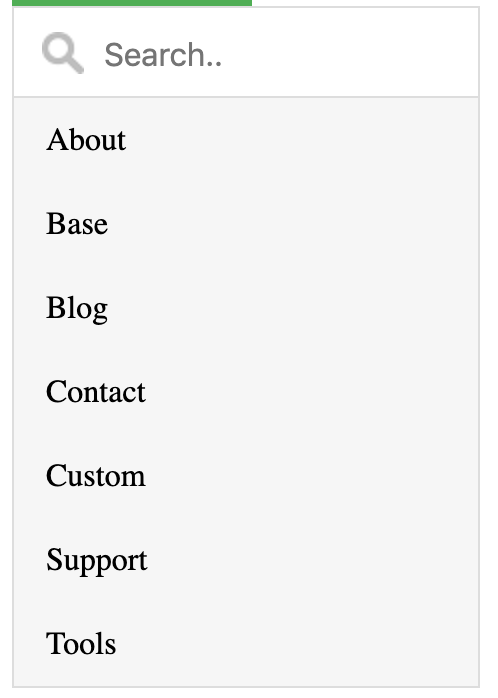

Hi there! As I mentioned in my
[last post that I was changing jobs](https://jnielson.com/jnielson-is-changing-jobs),
I've recently had the pleasure of starting in on some new projects at a new job.
It's been a rollercoaster trying to absorb as much information as possible while
also trying to contribute to the forward progress of the company and the
projects that I get to work on. It's really easy when starting on a new [Thing],
be that a project, employment opportunity, or something entirely different, to
be discouraged and overwhelmed at the sheer amount of imnformation you need to
gather. In this post I'll outline some of the thoughts I've had as I have dove
head first into my new job where I've worked on a major project and at least 3
smaller projects in my first two weeks.

## The high-level thoughts:

Super useful to **find someone you can ask all your questions to** (especially
if there isn't someone assigned specifically to help you get going). Make sure
it's okay with them (it usually is since it makes you more productive so much
faster)

Don't be afraid to **clarify processes**

Put up half-finished work to **get feedback** and make sure you're in line with
what they typically do

See if you can setup some **regular pair programming** (ideally with the same
person you ask quesitons to)

Find something you can do during work to **connect with people**, like foosball!

## Let's dive in!

The first thing I've appreciated with this new employment opportunity has been
the focus on helping me become familiar with the projects and productive as
quickly as possible. It's not fun to sit for a couple hours not knowing how to
move forward on a large project, since even the smallest task can be daunting in
a large codebase. The major project I'm working on has had a few devs working on
it for a while now, which means that it's super quick for them to do the small
task I was assigned... but if they do it I can't learn nearly as well! So, I'm
grateful that my company has a structure where there's a lead developer (lead
dev) who has it as a large part of their job description to directly support
other developers, especially the new ones. Sometimes this means that the lead
dev spends way more time supporting that new person on a task then it would take
for them to do it. A quick example...

 _This
screenshot is actually from
[a w3schools example](https://www.w3schools.com/howto/howto_js_filter_dropdown.asp)
since I was working on an internal project_

### Tale of the dropdown search field

One of the first small tasks I worked on was updating a dropdown search field to
automatically focus the search box when it is opened. While my lead dev could
have finished this task in probably 30 seconds, he assigned it to me knowing it
would take me way longer than that to finish. As is pretty typical when working
on a project for the first while, it can take a good amount of extra time to
track down where things are happening and how to adjust existing code (that was
written by someone else) to accomplish the task at hand. So, in this example I
poked around on the running site (locally) to figure out where the code for this
dropdown search field lived... and eventually found it. While I could have asked
my lead what file to make the change in, I've found it super helpful since then
to have spent some time digging around in the project as it built up some
context on where the various pieces are coming from and how they fit together.
